# Biểu đồ Tuần tự (Sequence Diagrams) cho 13 Use Cases

Dưới đây là 13 biểu đồ tuần tự tương ứng với 13 chức năng, được thiết kế theo chuẩn UML (Model-View-Controller) bao gồm các thành phần: **Actor** (Người dùng/Admin), **Form** (Giao diện/Boundary), **Control** (Bộ điều khiển/API Controller), và **Entity** (Thực thể/Cơ sở dữ liệu).

---

### 1. Tìm kiếm và Lọc mặt bằng nâng cao
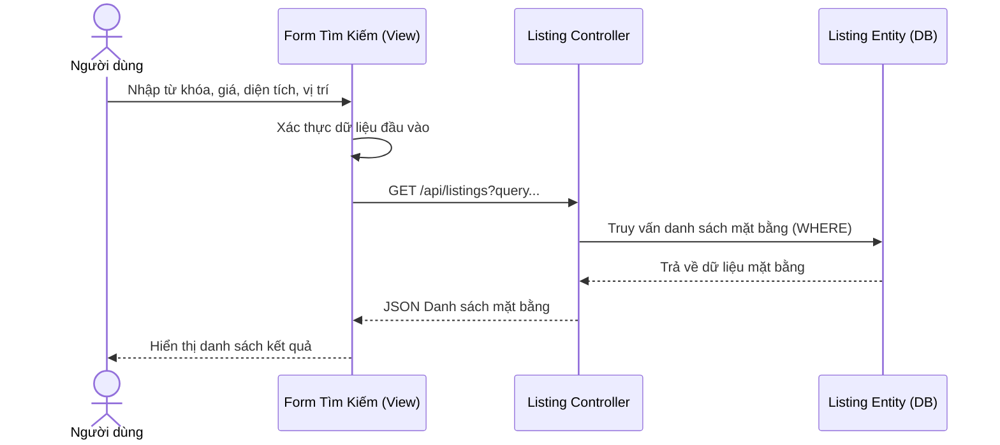

---

### 2. Xem bản đồ tương tác (Map View)
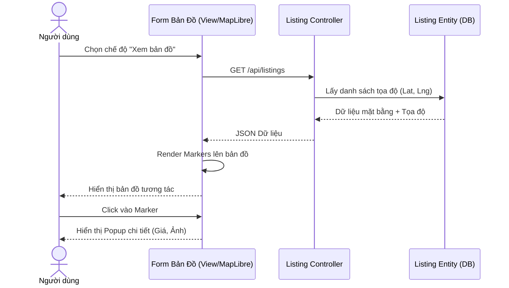

---

### 3. So sánh mặt bằng
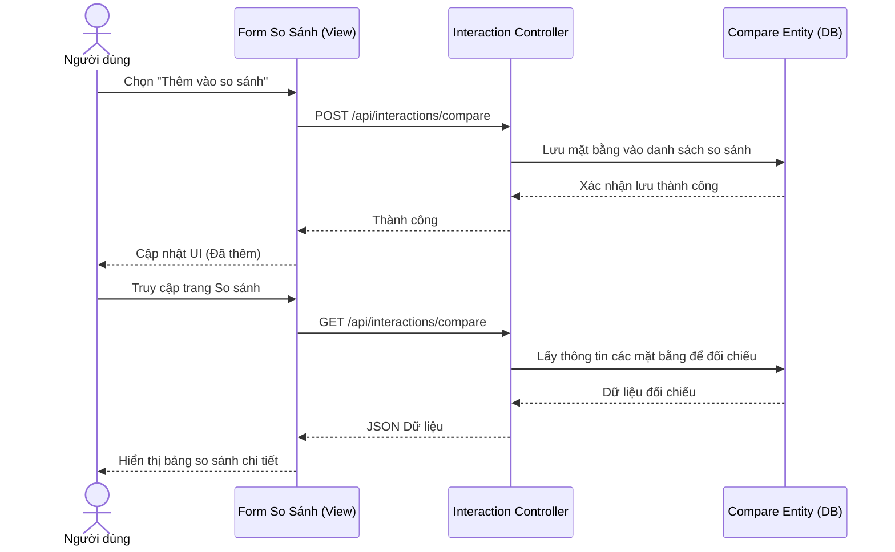

---

### 4. Xem lịch sử tìm kiếm gần đây
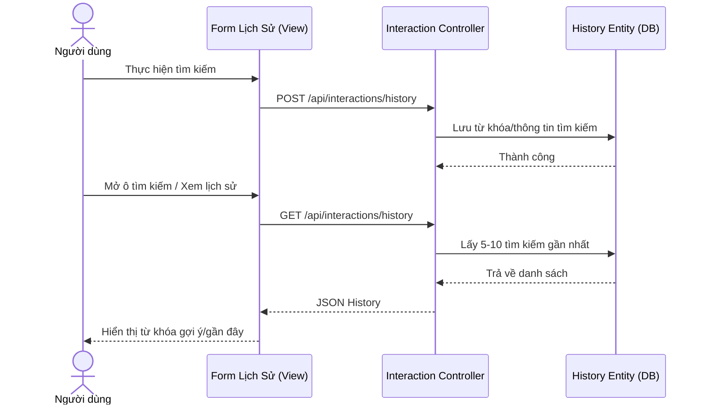

---

### 5. Trò chuyện với Chatbot AI
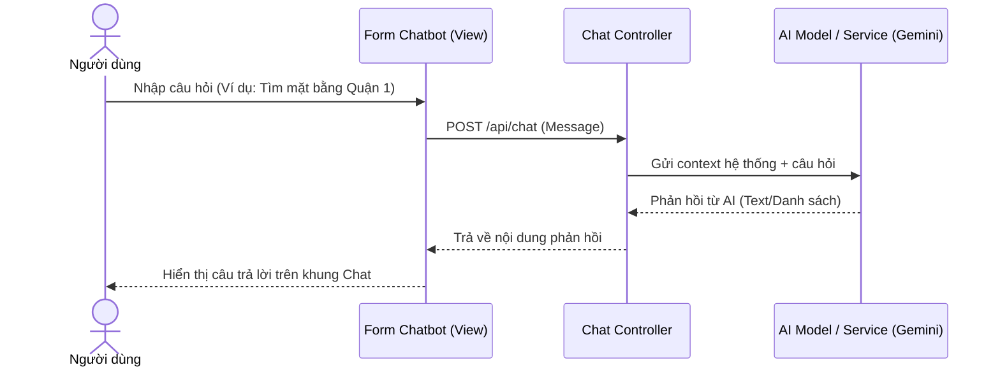

---

### 6. Xác thực Đăng nhập & Đồng bộ dữ liệu
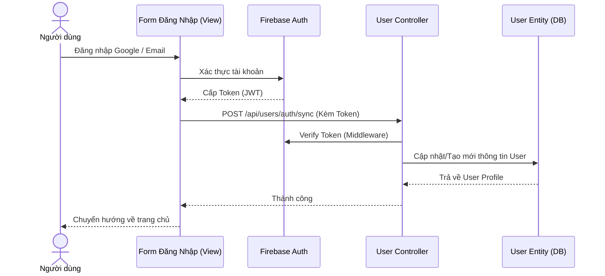

---

### 7. Quản lý tài khoản cá nhân
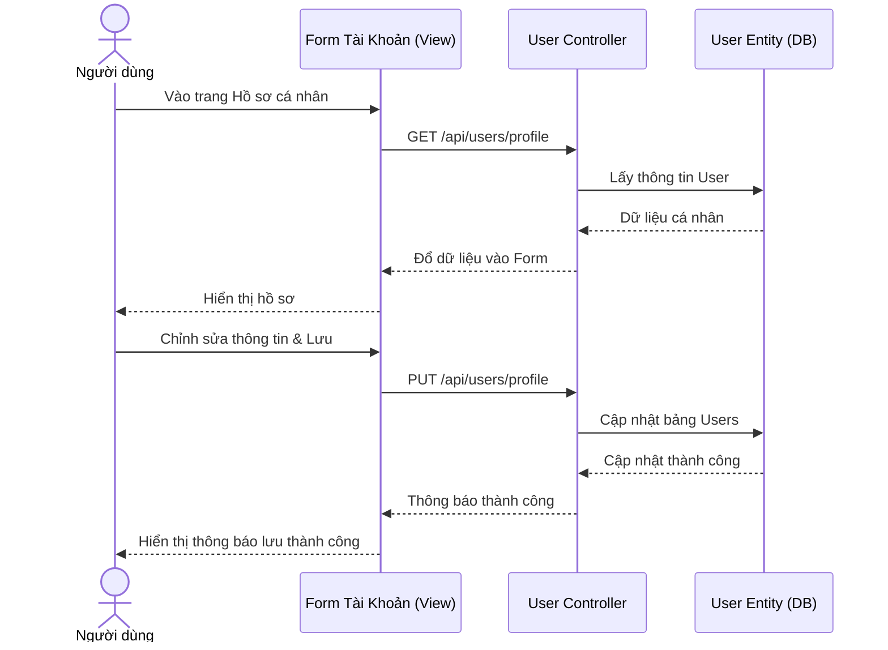

### 8. Đăng tin cho thuê mặt bằng
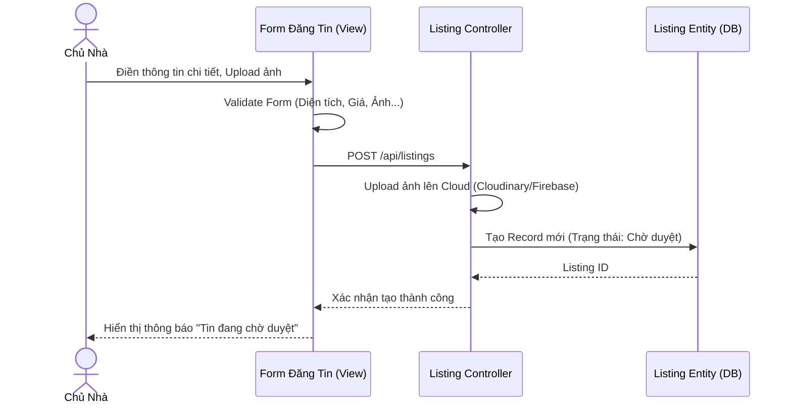

---

### 9. Quản lý tin đăng cá nhân
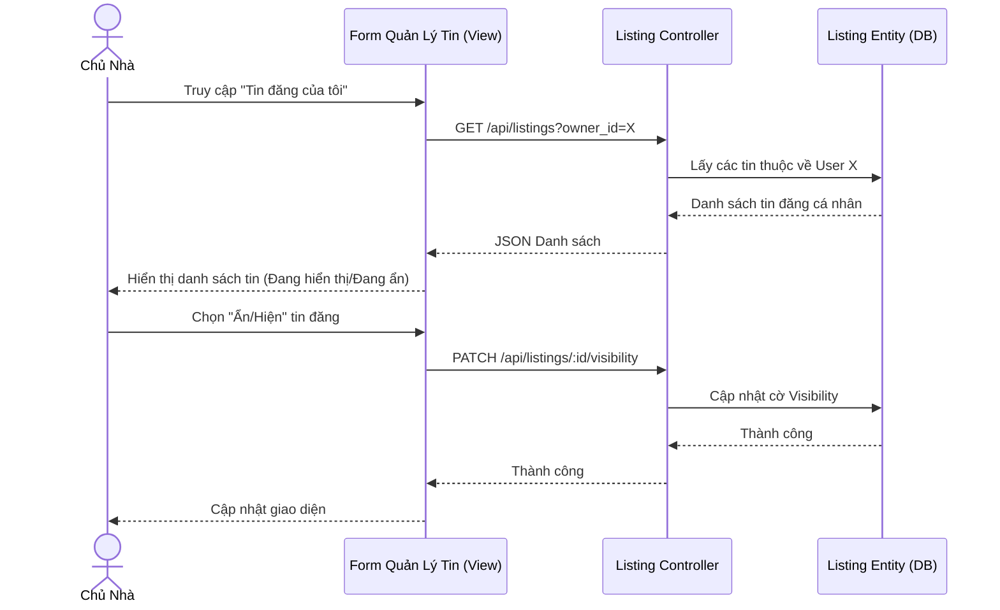

---

### 10. Viết đánh giá (Reviews) và Đánh giá sao
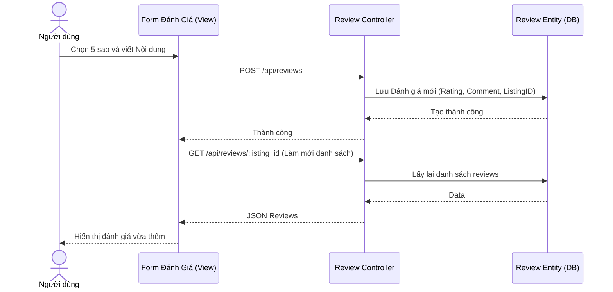

---

### 11. Dashboard thống kê chuyên sâu
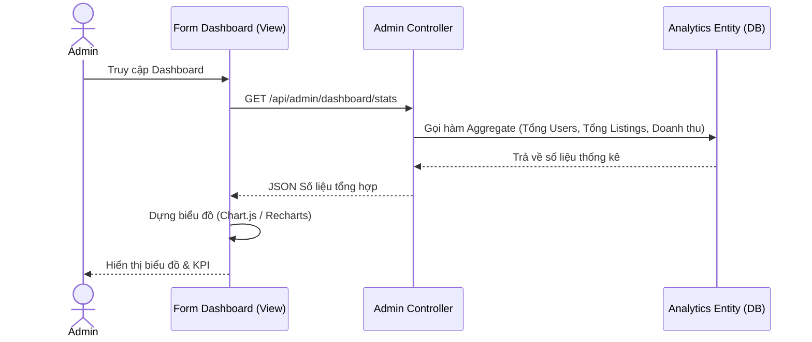

---

### 12. Quản lý và Phê duyệt tin đăng
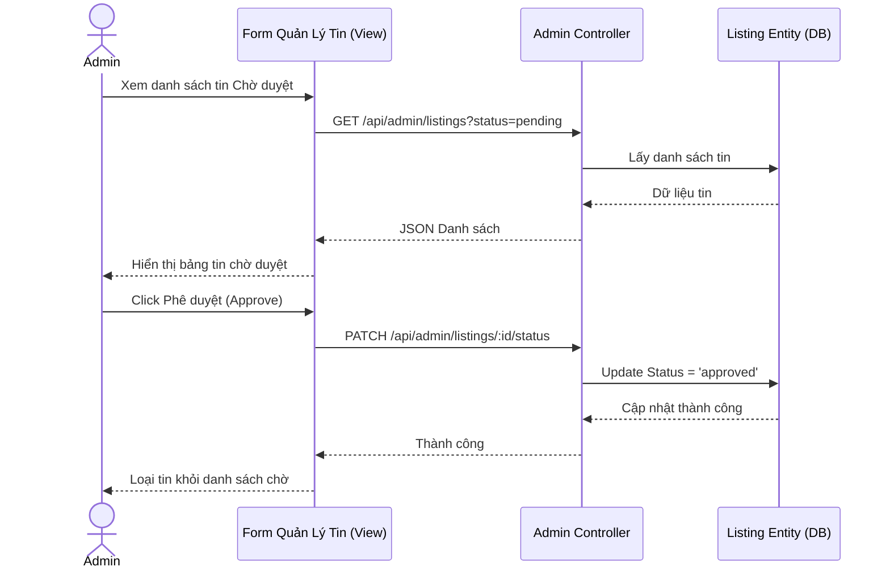

---

### 13. Quản lý người dùng
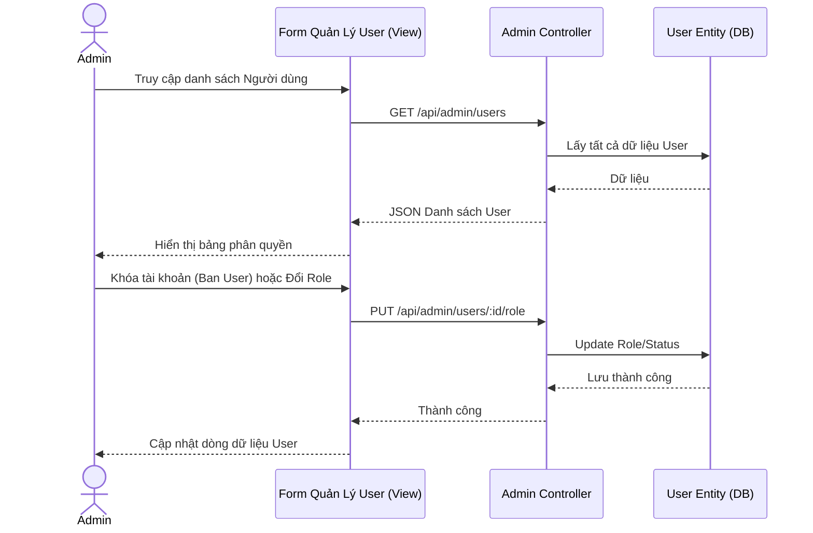
